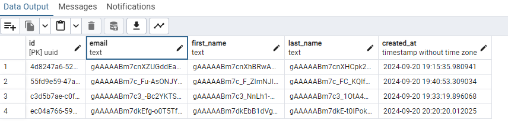

# Flask encryption using Postgres
A concept, for a requested solution, to keep personal information encrypted between two integrating parties and the postgres database it is stored in.

The idea is:
- All personal information is transmitted using JWE (JSON Web Encryption).  This is easy to setup using private and public keys.  All data is encrypted in transit, and therefore does not require special field mappings or field prefixes.
- The payload is decrypted, and the data is pushed into the model.
- The model is standard SqlAlchemy model which is easy to migrate and use in the normal way.
- However, the model inherits a metaclass which takes care of the field encryption on creation using SqlAlchemy's SymmetricEncryptionClientSide functionality.  This example uses the TypeDecorator approach.

## Requirements
- Python 3.10 (This is what I used)
- Postgres
- Postman (for testing)

## Setup
- Create your virtual environment `python -m venv .venv`
- Activate the environment `venv\Scripts\activate` (Windows)
- Install dependencies `pip install -r requirements.txt`
- Run flask`flask run` add `--debug` for testing.

## Seeing results
You can use the postman files included, or use the endpoints with a tool that uses the correct HTTP methods.  When the app is running you can use the endpoint `/encrypt-data` to generate an encrypted string, a JWE tokenized string.
For example passing in a raw json body like ```json
{"first_name": "Jack", "last_name": "Sparrow", "email": "jack.sparrow@piratebay.com"}```
will output:
```json
{"ciphertext":"JUfaKIUolC_2G12E5PCmRb5NgFuveDG3Emte6oXQX7uUQas09oRGVj_79tneVKARnxGty9GboWrY1dpqNmsJtEtfMb8vxNkUwXWena7JoinNxjPeCw","encrypted_key":"jhdlbQ3CyPQ693ZhGbxcI49h43zlNvG5h9VE38oVH5Onu4N7Q-ZOE2KKOs6N1L9RwLIuZRBtaCGVcVfHp8NxjGKKQV7W-Rx0xLuOrZIjKWHANzsvJ7ZjjSfRQA4aqybibrRKxr4Ed2pqJnucccZ6ZldN2rnrPQVeKUMjnbLygMU","iv":"C2iwAhumBMtt8vlt","protected":"eyJhbGciOiJSU0EtT0FFUCIsImVuYyI6IkEyNTZHQ00ifQ","tag":"bDHE5sLF5dgRq3i6cYModw"}
```
You can copy this text and use it in the POST request to endpoint `/register-user` which will store your user data encrypted.

When you want to view your information use the id that was returned in the previous step on endpoint `/get-user/4d8247a6-5265-4590-a766-d27dc753ab90`, for example.

Data is stored encrypted...


## Considerations
- This has not been load tested.  Searching or filtering for data in fields that are encrypted will need some work.
- Disclaimer, use at your own risk.  It's a concept.